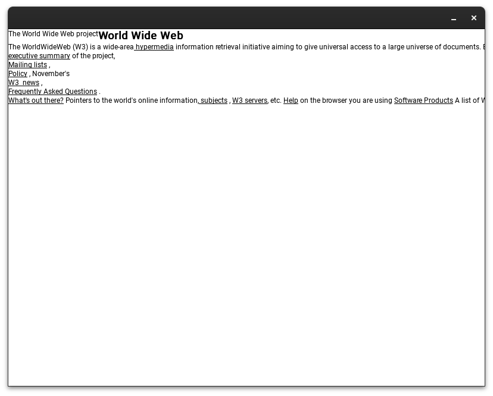

# unfinished

### This was implemented as part of the [Browser Jam](https://github.com/BrowserJam/browserjam)

Implemented tokenizer and parser in C, but couldn't finish rendering (with SDL and SDL_ttf). The parser itself seems robust enough and handles unclosed and omittable tags. Please don't cringe too much, I wrote this in a hurry :)

Build with (you need SDL2 and SDL2_ttf)
```
make
```

Run with 
```
main <html file>
```
Updated screenshot with some more progress:



Old screenshot:

